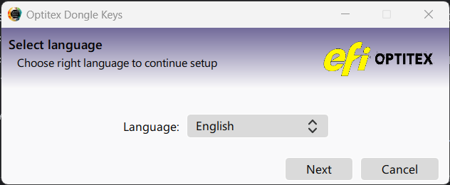
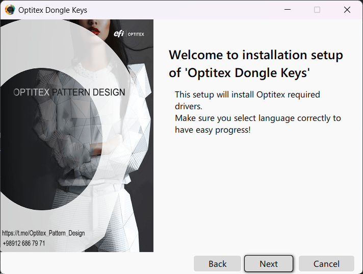
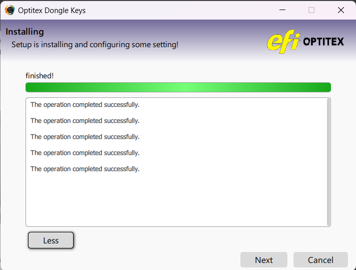

# Dongle

Cracker setup for ***Optitex Pattern Design*** made in ***Qt/C++***

> ### Program stages
> 1. ***Installation***:  
>     - Install **required files**
>     - **Add second stage** to startup programs
> 2. ***Finalize after restart***:
>     - Create icons etc

## Preview images
> 1. *Select setup language* 
> 
> 
> 
> 2. *Welcome dialog and some installation notes* 
> 
>
> 
> 3. *Installing progress* 
> 
